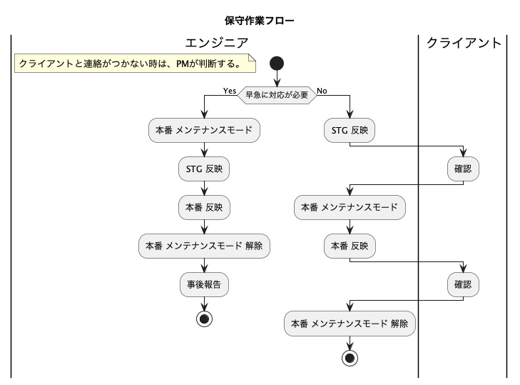

## 実行環境
```
・ローカル開発環境: Docker
・OS: Aamazon Linux2
・言語: PHP7.4, JavaScript、SCSS, Java(PlantUMLで利用)
・フレームワーク: Laravel8
・DB: MySQL8.0, Redis
・その他: nodejs, supervisor
・外部サービス: Stripe、Mailtrap、SES、S3
```
- [設計](_doc)
  - [API設計](_doc/_api)
  - [アクティビティ図](_doc/_flow)
  - [ガンチャート](_doc/_gunchart)
  - [リリース手順](_doc/_manual/release_method.md)
  - [料金体系](_doc/specification/price_structure.md)
- [グーグルドライブ ドキュメント類](https://drive.google.com/drive/folders/1GWqZ5UsQpZpgvSKwut5UjFDTgKUovH3t)
  - [テーブル項目](https://docs.google.com/spreadsheets/d/1aXf_s58dEkpHftt5SZ6Mt7pNZjWrPpsKRxbgCyrjD6k/edit?usp=drive_link)
  - [機能要件](https://docs.google.com/spreadsheets/d/1Un6kJiXORDB7IL-tZFadMV76EGYsggBg4N7Rnx8fVpA/edit?usp=drive_link)
  - [仕様書](https://docs.google.com/document/d/1B4tAxFx6ZfCI4rHaymtieBgN7sKalyWpnwcUaVXrSDc/edit)
  - [ネットワーク](https://drive.google.com/drive/folders/1dFCo0gNn4jnhcaVp8XIIc9hUzQAp3VdF)
- [Dockerプロジェクト](https://github.com/yamada-ham/centos7_php7_mysql8)

<br>

## ローカル環境構築

```
# クローン
git clone URL

# composer更新
composer update

# エラー「Please provide a valid cache path.」
# エラー「file_put_contents(xxxx/project-name/storage/framework/sessions/xxxxxx): failed to open stream: No such file or directory」「Please provide a valid cache path.」の対処法。キャッシュ用のディレクトリが存在しないことが原因なので手動作成
mkdir -p storage/framework/cache/data/
mkdir -p storage/framework/app/cache
mkdir -p storage/framework/sessions
mkdir -p storage/framework/views

# .env.exampleコピーして .envにリネーム(DB、Mail、Stripeの設定をする)
cp .env.example .env 
cp .env.example .env.testing

# .env key値生成
php artisan key:generate

# シンボリック
php artisan storage:link
#ErrorException  : symlink(): No such file or directory 対策
rm public/storage


# パッケージインストール
npm install && npm run dev

# DBマイグレーション
php artisan migrate (マイグレーションに変更あるときのみ)
php artisan migrate:fresh --seed (初回デプロイ時のみ)


# サーバ立ち上げ(ローカル)
php artisan serve
php artisan serve --host=0.0.0.0 #ホスト指定

# Cron 登録
* * * * * cd プロジェクトパス && php artisan schedule:run >> /dev/null 2>&1
```

<br>

# テスト
## 単体テスト
### テスト手順
```
# 依頼者のテスト
php artisan migrate:fresh --seed
sh phpunit_delivery_office.sh

# ドライバーのテスト
php artisan migrate:fresh --seed
sh phpunit_driver.sh

# ゲストやその他のテスト
sh phpunit_guest.sh
```

### テストで使うコマンド
```
# シェルでphpUnitのテストを実行(テスト本番で使う)
sh phpunit_delivery_office.sh
sh phpunit_driver.sh

# ディレクトリを指定してテスト実行 例
./vendor/bin/phpunit tests/Unit/Api/Normal/DeliveryOffice

# ファイルを指定してテスト実行 例
./vendor/bin/phpunit tests/Unit/Api/Normal/DeliveryOffice/DriverTest.php

# テストファイル作成
php artisan make:test Api/DeliveryOffice/名前Test --unit
```

### 説明
```
# テストに関するデータの保存ディレクトリ
storage/private/unit_test

# テストで使うAPIトークン (自動生成)
storage/private/unit_test/api_token_delivery_office.txt
storage/private/unit_test/api_token_driver.txt

# テスト結果CSV (自動生成)
storage/private/unit_test/unit_test_evidence_delivery_office_api.csv
```

<br>

## Dusk ブラウザテスト
### 準備
```
# Dusk導入
# Dusk 画面テストする場合のみ(新しいバージョンだと動かないのでver72を利用)
php artisan dusk:install
php artisan dusk:chrome-driver 72

# --rootユーザーだとChromが動かない。rootユーザーの場合はユーザーを作成する--
useradd browser_user

sudo visudo
# 以下追記
browser_user ALL=(ALL) NOPASSWD: ALL

su - browser_user

sudo chmod -R 777 /tmp

# テスト実行 (プロジェクトのパスに移動後)
php artisan dusk
```


<br>

## DBデプロイテスト
目的: マイグレーション、シーダーを実行する際、既存データに影響がないか確認する
```
# --データを入れる パターン1--
# mainブランチ
git checkout main
# .envの設定 APP_ENV=local
php artisan migrate:fresh --seed

# --データを入れる パターン2--
mysql -u root -p

drop database DB名;
create database DB名 character set utf8 COLLATE utf8_general_ci;
use DB名
source /var/www/html/backup_sql/export.sql

# 作業ブランチ
# .envの設定 APP_ENV=production
git checkout feature/api

# マイグレーション
php artisan migrate

# シーダー
php artisan db:seed
```

<br>

## よく使うコマンド
```
#--ドキュメント生成--
# error_reporting=E_ERROR - エラー非表示
php -d error_reporting=E_ERROR phpDocumentor.phar -d app -t _phpdoc

#--PlantUMLで画像生成--
java -jar plantuml-1.2023.5.jar -Tpng ./_doc/パス/ファイル名.pu

#--静的解析ツール Psalm--
# psalm.xmlファイルに設定を記述
./vendor/bin/psalm

#--PHPコーディング規約解析 PHP_CodeSniffer--
# phpcs.xmlファイルに設定を記述
./vendor/bin/phpcs

#--MySQLのエクスポート--
DATE=`date '+%Y-%m-%d_%H_%M_%S'` \
mysqldump -h ホスト名 -u root -proot ksring  > "/home/ユーザー名/backup_db/${DATE}_export_ksring.sql" --set-gtid-purged=OFF --verbose

#--MySQLのインポート。 本番データでテストするときに利用。 MySQL Clientコマンド---
drop database ksring;
create database ksring character set utf8 COLLATE utf8_general_ci;
use ksring
source ~/backup_dbス/日付_export_ksring.sql

#--Redis--
# 起動確認
systemctl status redis
redis-cli ping

#--キュー--
#失敗したJob一覧
php artisan queue:failed
#ジョブ削除
php artisan queue:flush

#--Supervisor--
# 起動
sudo supervisord -c /etc/supervisord.conf
# 設定反映
sudo supervisorctl reread
sudo supervisorctl update
sudo supervisorctl restart laravel-worker:*
# 起動確認
sudo supervisorctl status
```

## 自作コマンド
- [自作コマンド](app/Console/Commands)
```
# システムレポート
php artisan command:system_report

# ユーザーのパスワードをテスト用に一括変更
php artisan command:user_test_password
```


## ドキュメント 利用ツール
```
・ドキュメント生成ツール: phpDocumentor、PlantUML
・フローチャートやER図: drawio
・API設計ツール: OpenAPI
```

## 導入したプラグイン、パッケージ、ライブラリ
＊ 導入するときは相談すること。
```
phpDocumentor.phar // ドキュメント生成ツール(手動で導入)

#--デバッグバー--
barryvdh/laravel-debugbar 
$ composer require barryvdh/laravel-debugbar

#--ログイン機能--
Laravel Breeze
$ composer require laravel/breeze --dev
$ php artisan breeze:install

#--日本語化--
$ php -r "copy('https://readouble.com/laravel/8.x/ja/install-ja-lang-files.php', 'install-ja-lang.php');"
$ php -f install-ja-lang.php
$ php -r "unlink('install-ja-lang.php');"

#--phpMyAdmin--
# カレントディレクトリ プロジェクト/public/ 
$ wget https://www.phpmyadmin.net/downloads/phpMyAdmin-latest-all-languages.tar.gz
$ mkdir phpMyAdmin && tar -xvzf phpMyAdmin-latest-all-languages.tar.gz -C phpMyAdmin --strip-components 1
$ rm phpMyAdmin-latest-all-languages.tar.gz

#--PDF作成--
# 導入
$ composer require barryvdh/laravel-dompdf
# 設定ファイル 作成
$ php artisan vendor:publish --provider="Barryvdh\DomPDF\ServiceProvider"
# 書き出されたフォントが入るディレクトリ作成
mkdir storage/fonts

#--Larave-Excel(CSV Excel インポートエクスポート)--
composer require maatwebsite/excel
# クラスを作成するコマンド 例
php artisan make:export DriverExport --model=Driver
php artisan make:import DriverImport --model=Driver

#--aws SESメールシステムを利用するため--
composer require aws/aws-sdk-php

#--aws S3を利用するため--
composer require --with-all-dependencies league/flysystem-aws-s3-v3 "^1.0"

#--エディタjs Quill--
npm install quill

#--静的解析 Psalm--
composer require --dev vimeo/psalm
./vendor/bin/psalm --init

#--PHPコーディング規約解析 PHP_CodeSniffer--
composer require --dev squizlabs/php_codesniffer

#--決済ライブラリ cashier stripeで利用--
composer require laravel/cashier
# マイグレーションをカスタム users → 指定のモデル
php artisan vendor:publish --tag="cashier-migrations"
# app/Providers/AppServiceProvider.php の変更

#--DBカラムのリネームするのに利用--
composer require doctrine/dbal

#--Sanctum モバイルAPI認証--
composer require laravel/sanctum
# デフォルトのマイグレーションを無視する App\Providers\AppServiceProvider.php
# デフォルトマイグレーションをエクスポート 2019_12_14_000001_create_personal_access_tokens_table.php が作成される。
php artisan vendor:publish --tag=sanctum-migrations
# 利用するguardを設定 config/sanctum.php
# abilityでアクセス制限 app/Http/Kernel.php

#--Slack通知--
# Slack通知パッケージの導入
composer require laravel/slack-notification-channel
# SlackでIncoming Webhookの設定をする
# .env の「SLACK_WEBHOOK_URL」と「SLACK_SENDER_NAME」に値を設定をする
# 編集したファイル
app/Notifications/SlackNotification.php
app/Providers/SlackServiceProvider.php
app/Services/SlackNotificationService.php
config/slack.php

#--祝日を扱う--
composer require azuyalabs/yasumi

#--APIを叩く--
composer require guzzlehttp/guzzle
```
<br>

## カスタマイズするため作成したlarabel パッケージ
```
php artisan vendor:publish --tag=laravel-errors
```
<br>

## 規則
### 命名規則
キャメルケース(先頭を小文字で、各単語の最初を大文字でつなぐ）例: autoComplete   
アッパーキャメルケース(単語の先頭をすべて大文字でつなぐ) 例: AutoComplete  
スネークケース(単語の間をアンダーバーでつなぐ) 例:auto_complete  
ケバブケース(単語の間をハイフンでつなぐ) 例:auto-complete
```
クラス(ファイル)名 ... アッパーキャメルケース
関数 ... キャメルケース
変数 ... スネークケース
ディレクトリ、ファイル名 ... スネークケース
URL ... ケバブケース(SEO的に微妙に良いので)
```

### コントローラーのメソッド名 命名規則
| メソッド名 | 役割 | URL | CRUD | 送信方式 |
| :--- | :--- | :--- | :--- | :--- |
| index | ページ表示 | / | R| GET |
| read | 一覧読み込み | /read | R | GET |
| create | 作成ページ表示 | /create | R | GET |
| store | 作成処理 | /store | C | POST |
| show | 詳細ページ表示 | /show | R | GET |
| edit | 編集ページ表示 | /edit | R | GET |
| update | 更新処理 | /update | U | POST |
| upsert | 更新 or 作成処理 | /upsert | CR | POST |
| destroy | 削除処理 | /destroy | D | POST |


### コーディング規則
記述中

### エディタ
VSCode
.vscode/settings.json を利用して設定を統一。

### エディタ フォーマッタ形式
```
  スペース2つによるインデント - blade.php scss
  スペース4つによるインデント - php、js
```

### コメント規則
PHPのコメントはPHPDocのルールに従う。[リファレンス](https://zonuexe.github.io/phpDocumentor2-ja/references/phpdoc/index.html)

JavaScriptのコメントはJSDocのルールに従う。[リファレンス](https://www.typescriptlang.org/ja/docs/handbook/jsdoc-supported-types.html)

### フォーマッタ規則
```
[JavaScript,SCSS] 
・Prettier, Eslint を使う。
・スペースによるインデント。
・タブでスペース2個分

[PHP]
・スペースによるインデント。
・タブでスペース4個分

[blade.php]
・スペースによるインデント。
・タブでスペース2個分
```

### SCSS規則
```
# 接頭辞
ly_ : 大枠。
bl_ : ブロック。
el_ : ブロックごとの部分的な違いのスタイリングに当てる。
c_ : コンポーネント。多くの頻度で使い回すブロック。
u_ : ユーティリティ。微調整に使う。
js_ : jsで利用。


# 利用例
.bl_page {
  .bl_page_inner {
    .el_width10rem {
      width: 10rem;
    }
  }
}
```
### APIレスポンス形式
```
{
  "status": "success",
  "message": "メッセージ",
  "data": {},
}
```

### ブランチ命名規則
| ブランチ名 | 役割 | 派生元 | マージ先 | 内容 |
| :--- | :--- | :--- | :--- | :--- |
| main | 公開用 |  | なし | 本番反映用 |
| develop | 開発完了 | main | staging,main | テスト完了後、mainブランチにマージ |
| feature/* | 新機能開発中 | main | develop | 新規 |
| hotfix/* | 公開中のバグ修正 | main | develop | 修正 |
| prototype/* | 研究開発 | * | * | 試験的に実装する |

「*」には「作業内容」 

### コミット メッセージの記述方法
```
# 作業中のissueを指定 例:driver スケジュールデザイン修正 #51
git commit -m"区分 内容 #issue番号"

# 完了したissueを閉じる。
git commit -m"区分 内容 close #issue番号"
```

### 作業ルール
- 1ブランチにつき1人。複数人で一つのブランチを作業しない。
- 設計と成果物の内容が異なることがないように、設計を随時更新する。
- リーダブルコードを意識。
- 段階的にフィードバックを行う。


### 修正、保守対応のルール
  
- システムや業務に影響のない軽微な対応: 直接本番に反映 → 報告  
- システムや業務に影響のある対応 & デザインが大きく変わる対応:  STGに反映 → 報告 → 本番メンテナンスモード → 本番に反映 → 報告 → メンテナンスモード解除

-対応の時期-  
- 業務遂行に影響が出る問題: 早急に対応。  
- 業務遂行に影響がない問題: 手隙きのとき対応。短期間に複数箇所の対応が見込まれる場合は、ある程度蓄積させてから対応でもOK。

### 指示 ルール
・ テキストは、コピー&ペーストできる状態にする。
